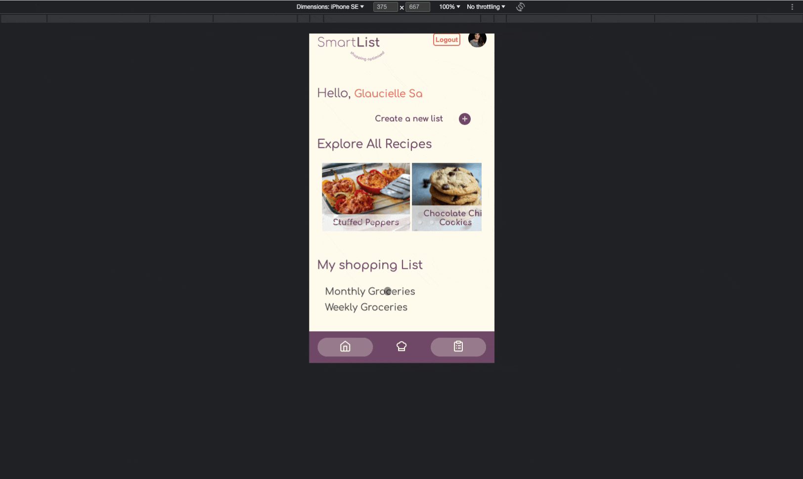
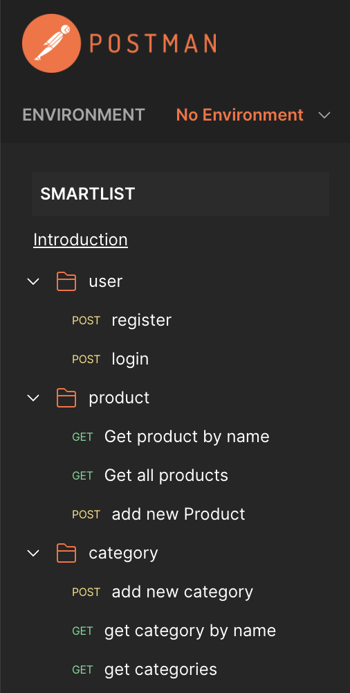
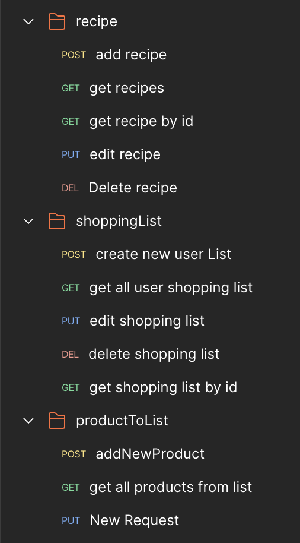
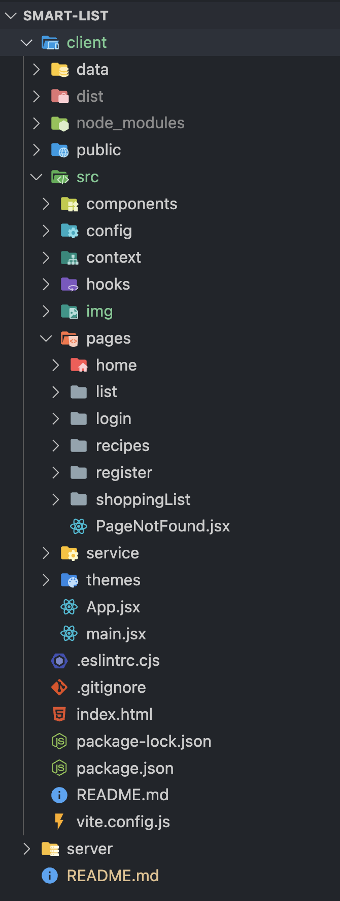
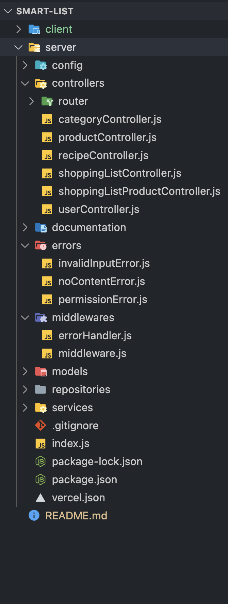

# About Smart List App

**Smart List** is a user-friendly full-stack MERN application destined to simplify the management of **shopping lists and recipes** by combining them on the same app. This approach allows streamlined **shopping and meal planning** by storing and accessing favourite recipes while generating accurate shopping lists, reducing food and money waste.

Whether you're using a desktop computer or a mobile device, Smart List is designed to provide a **responsive and seamless UI experience**, ensuring that you can effortlessly manage your recipes and shopping lists on any screen size.

## Links

- Repo: [smart-list](https://github.com/glauciellesa/smart-list)

- Vercel deployment: [Visit Now](https://smart-list-client.vercel.app/)

- Api documentation: [Visit Now](https://documenter.getpostman.com/view/26738001/2s9Y5ZuMEH)

## ⚙️ Technologies

          

## Sneak Peeks in Smart List

 <p align="center">  </p>

## 🚀 Features:

- Login/logout/register User Account
- Create a new shopping list
- Consult shopping list
- Edit shopping list
- Delete shopping list
- Create a new recipe
- Consult a recipe
- Create a new recipe
- Like a recipe

## Server

- Complete and extremely scalable Node.js backend. Controllers are VERY easily added, scaled and separated due to the MVC pattern used.
- JWT Authentication Middleware: verify SignUp, verify token Routes protected.
- Secure password hashing by default Mongodb REST architecture.

<br>

<div align="center">

| Server Architecture                                                                                               |                                                                                                                   |
| ----------------------------------------------------------------------------------------------------------------- | ----------------------------------------------------------------------------------------------------------------- |
| <p align="center">  </p> | <p align="center">  </p> |

</div>

## Client

- React JS Redux (for managing and centralizing application state)
- React-router-dom (To handle routing)
- Axios (For making HTTP requests )
- Styled Component (for User Interface)
- React Hooks (for a more intuitive and flexible way to manage component state and side effects in functional components)

<br>

## Directory structure of our Node.js Express & MongoDB application:

<br>

<div align="center">

| Client directory                                                                                                                   | Server directory                                                                                                                  |
| ---------------------------------------------------------------------------------------------------------------------------------- | --------------------------------------------------------------------------------------------------------------------------------- |
| <p align="center">  </p> | <p align="center">  </p> |

</div>

## Available Commands

The main directory contains two directories, `client` and `server`, respectively for the frontend and the backend part of the application. Make sure to run the following command in both the `client` and `server` directory:

```
npm run dev
```

👆 This command starts your project in development mode using Vite. It's perfect for actively working on your project, as it enables hot module replacement (HMR), meaning your changes will instantly appear in the browser without the need for manual refreshing.

```
npm run build
```

👆 Use this command to build your project for production. It optimizes and bundles your code, ensuring the best performance. The result will be placed in the "build" directory, ready for deployment.

## Future features ⏱️

- Some filters to sort the recipes
- Possibility to delete the default recipes
- Accessing the recipes of another user and following his/her newly added recipes
- Importing recipes from other sites
- Possibility to import ingredients from a recipe to the shopping list

## License

Distributed under the MIT License.

## Authors

**Glaucielle Sá**

- [GitHub Profile](https://github.com/glauciellesa "Glaucielle Sá")
- [Linkedin](https://www.linkedin.com/in/glauciellec/)
- [Portfolio](https://glauciellesa.github.io/ "Have a look!")

**Camila Fernandes Assunção**

- [GitHub Profile](https://github.com/CamilaFAssuncao "Camila Fernandes Assunção")
- [Linkedin](https://www.linkedin.com/in/camilafassuncao/)

**Leila Zitouni**

- [GitHub Profile](https://github.com/leilaZ1111 "Leila Zitouni")
- [Linkedin](www.linkedin.com/in/leila-zitouni)

## 🤝 Support

Contributions, issues, and feature requests are welcome!

Give a ⭐️ if you like this project!
