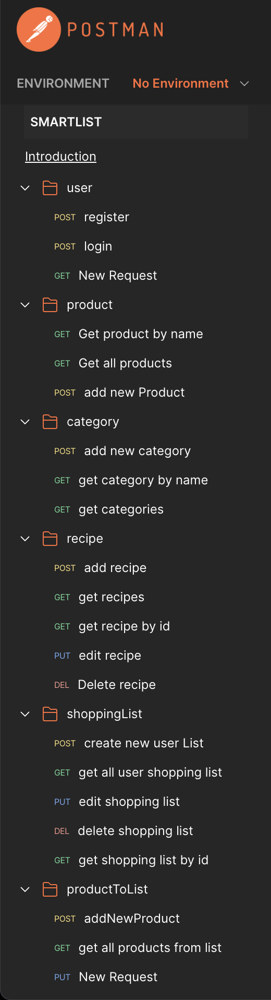
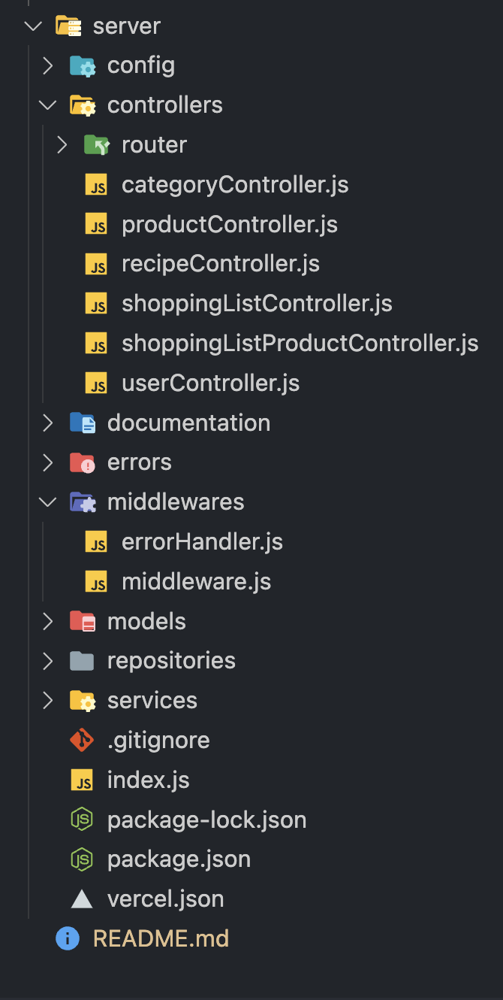

# About Smart List App

**Smart List** is a user-friendly full-stack application destined to simplify the management of **recipes and shopping lists** by combining them on the same app. This approach allows streamlined **meal planning and shopping** by storing and accessing favourite recipes while generating accurate shopping lists, reducing food and money waste.

## Links

- Repo: [smart-list](https://github.com/glauciellesa/smart-list)

- Vercel deployement: [Visit Now](https://smart-list-client.vercel.app/)

## ⚙️ Technologies

          

## Sneak Peeks in Smart List


## 🚀 Features:

- Login/logout/register User Account
- Create a new shopping list
- Consult shopping list
- Edit shopping list
- Delete shopping list
- Create a new recipe
- Consult a recipe
- Create a new recipe
- Like a recipe

## Server

- Complete and extremely scalable Node.js backed. Controllers are VERY easily added, scaled and separated due to the MVC pattern used.
- JWT Authentication Middleware: verify SignUp, verify token Routes protected.
- Secure password hashing by default Mongodb REST architecture.

<div align="center">



</div>

This is the directory structure for our Node.js Express & MongoDB application:

<div align="center">



</div>

## Client

- React JS Redux (for managing and centralizing application state)
- React-router-dom (To handle routing)
- Axios (For making HTTP requests )
- Styled Component (for User Interface)
- React Hooks (for a more intuitive and flexible way to manage component state and side effects in functional components)

## Available Commands

In the project directory, you can run:

```
npm run dev
```

This command starts your project in development mode using Vite. It's perfect for actively working on your project, as it enables hot module replacement (HMR), meaning your changes will instantly appear in the browser without the need for manual refreshing. You can access your development server at [http://localhost:5174/](http://localhost:5174/).

```
npm run build
```

Use this command to build your project for production. It optimizes and bundles your code, ensuring the best performance. The result will be placed in the "build" directory, ready for deployment.

```
npm run preview
```

Running this command will start a local server to preview your production build. It's useful for testing your build locally before deploying it to a live server. You can typically access the preview at [http://localhost:4173/](http://localhost:4173/) or another port specified in the output.

```
npm start
```

Similar to `npm run dev`, this command starts your project using Vite. It's often used when you want to quickly run your project without any special development features. You can access it at [http://localhost:5176/](http://localhost:5176/).

Please replace `npm` with `yarn` if you are using Yarn as your package manager.

## Future features ⏱️

- Some filters to sort the recipes
- Possibility to delete the default recipes
- Accessing the recipes of another user and following his/her newly added recipes
- Importing recipes from other sites

## License

Distributed under the MIT License.

## Authors

**Glaucielle Sá**

- [GitHub Profile](https://github.com/glauciellesa 'Glaucielle Sá')
- [Linkedin](https://www.linkedin.com/in/glauciellec/)
- [Portfolio](https://glauciellesa.github.io/ 'Have a look!')

**Camila Fernandes Assunção**

- [GitHub Profile](https://github.com/CamilaFAssuncao 'Camila Fernandes Assunção')
- [Linkedin](https://www.linkedin.com/in/camilafassuncao/)

**Leila Zitouni**

- [GitHub Profile](https://github.com/leilaZ1111 'Leila Zitouni')
- [Linkedin](www.linkedin.com/in/leila-zitouni)

## 🤝 Support

Contributions, issues, and feature requests are welcome!

Give a ⭐️ if you like this project!
